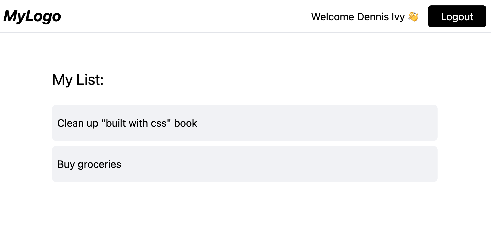
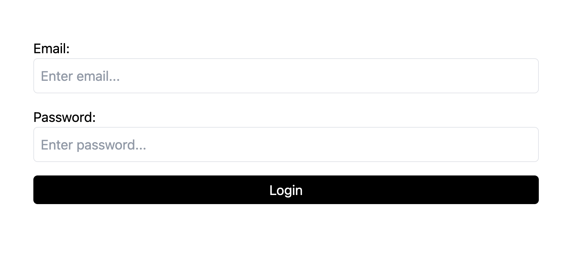

A minimalist example for handeling user authentication and protected routes with NextJS 14, using SSR with server actions.

**Home page (Protected Route)**


**Login Page**


## Getting Started

First, install dependencies:

```bash
npm install
```

Then, run the development server:

```bash
npm run dev
# or
yarn dev
# or
pnpm dev
# or
bun dev
```

Open [http://localhost:3000](http://localhost:3000) with your browser to see the result.

You can start editing the page by modifying `app/page.js`. The page auto-updates as you edit the file.
